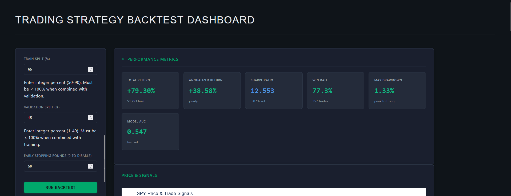
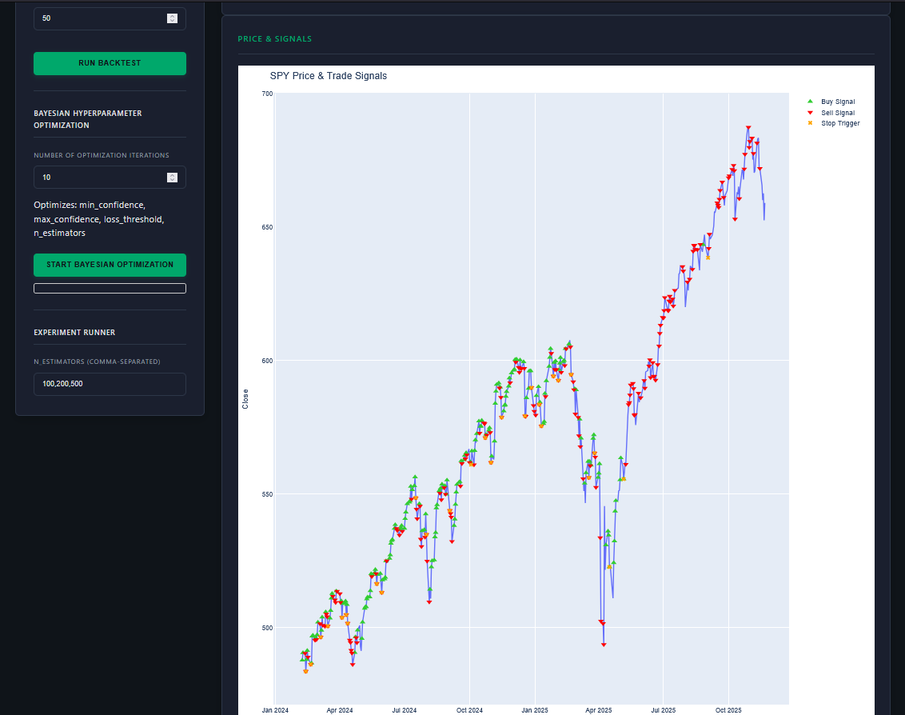
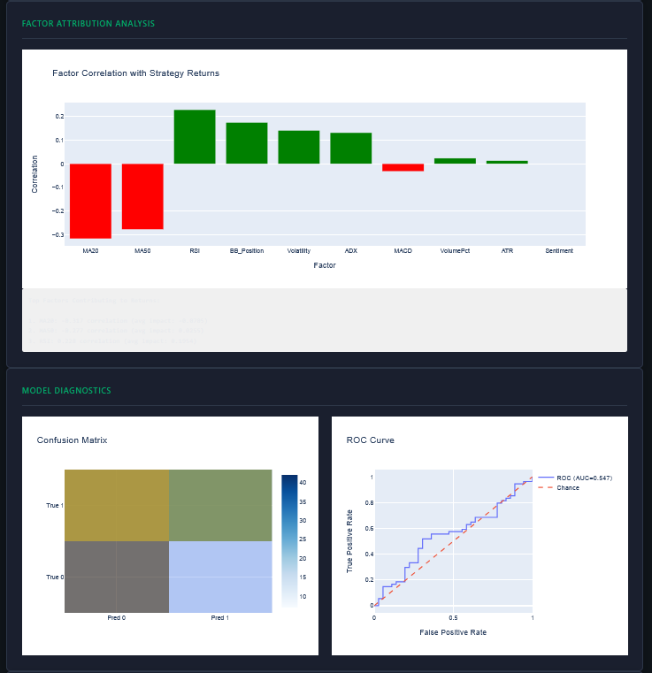
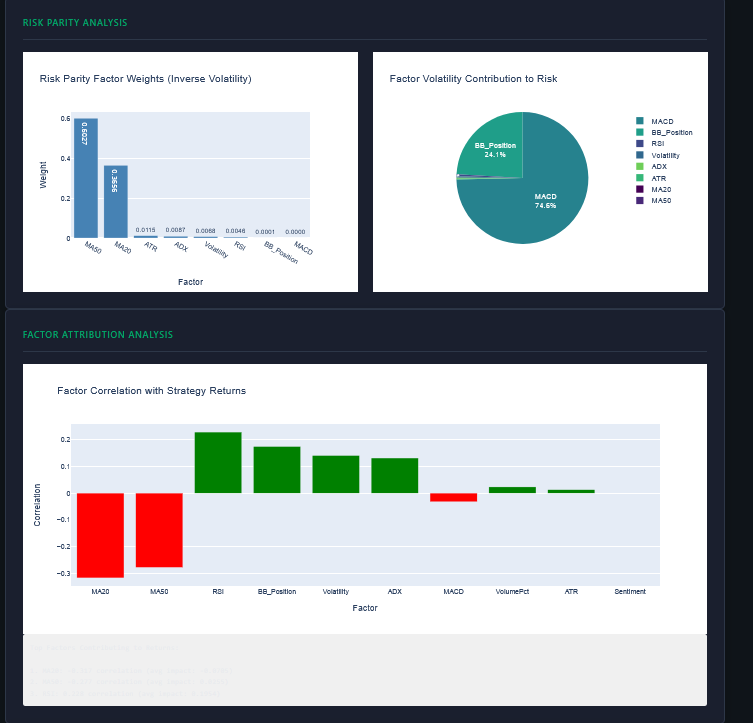

# Quantitative Trading Strategy Dashboard

[](https://www.python.org/downloads/)
[](https://opensource.org/licenses/MIT)
[](https://github.com/psf/black)

A professional-grade quantitative trading backtesting framework with interactive machine learning capabilities, built for algorithmic traders and quantitative analysts.

## 🖼️ Dashboard UI Showcase

Experience a professional, dark-mode interface designed for quantitative analysts. The dashboard combines institutional-grade aesthetics with powerful analytics capabilities, featuring interactive charts, real-time metrics, and comprehensive model diagnostics.

<table>
  <tr>
    <td align="center">
      
      <br/><em>Analysis KPIs</em>
    </td>
    <td align="center">
      
      <br/><em>Model Output</em>
    </td>
  </tr>
  <tr>
    <td align="center">
      
      <br/><em>Factor Attribution</em>
    </td>
    <td align="center">
      
      <br/><em>Factor Attribution Analysis</em>
    </td>
  </tr>
</table>

> 💡 **Professional UI/UX**: These screenshots demonstrate the dashboard's enterprise-grade interface featuring interactive Plotly visualizations, real-time performance metrics, risk analytics, and comprehensive model evaluation tools—all styled with a modern dark theme optimized for extended trading sessions.

## 🎯 Features

### Core Backtesting Engine
- **Risk-Aware Simulation**: Dynamic position sizing with stop-loss and trailing stops
- **Walk-Forward Validation**: Robust 65/20/15 train/test/validation split methodology
- **High-Fidelity Execution**: Realistic slippage and commission modeling with daily and intraday OHLCV data
- **Intraday Support**: Trade on 5-minute, 15-minute, hourly, or daily bars

### Machine Learning
- **XGBoost Classifier**: Production-grade gradient boosting with 500+ decision trees
- **14+ Technical Indicators**: 
  - Momentum: MACD, RSI, ADX
  - Volatility: ATR, Bollinger Bands, Annualized Volatility
  - Trend: Moving Averages (20/50-day), Plus DI/Minus DI
  - Sentiment: Real-time news sentiment scoring
  - Volume Analysis: Percentage changes and extrema detection
- **Early Stopping**: Prevent overfitting with configurable rounds on validation set

### Interactive Dashboard
- **Real-time Parameter Tuning**: Adjust strategy parameters and model hyperparameters on-the-fly
- **Professional Visualizations**: 
  - Price action with entry/exit signals
  - Portfolio equity curve with drawdown analysis
  - Daily returns distribution (histogram)
  - Confusion matrix for binary classification diagnostics
  - ROC curve with AUC scoring
- **Live Experiment Runner**: Grid search and random search over hyperparameter space
- **Async Processing**: Non-blocking background thread execution for long-running experiments

### Enterprise Features
- **Model Persistence**: Automatic saving of trained models and metrics to `runs/` directory
- **Experiment Logging**: CSV export of all experiment results with full parameter tracking
- **Production Metrics**: Sharpe ratio, max drawdown, win rate, and ROC AUC
- **Risk Metrics**: Daily volatility, trailing stop analysis, and loss threshold triggering

## 📊 Dashboard UI

The dashboard features a professional, dark-mode design inspired by enterprise trading platforms. See the [Dashboard UI Showcase](#-dashboard-ui-showcase) above for actual screenshots.

```
┌─────────────────────────────────────────────────────────────────────────┐
│  TRADING STRATEGY BACKTEST DASHBOARD                                    │
├─────────────────┬─────────────────────────────────────────────────────┤
│ Strategy        │                    Results                         │
│ Controls        │  ┌─────────────────────────────────────────────┐  │
│                 │  │ Total Return  │ Sharpe Ratio │ Win Rate      │  │
│ • Symbol        │  │   +61.84%     │     10.92    │   74.14%      │  │
│ • Date Range    │  └─────────────────────────────────────────────┘  │
│ • Capital       │                                                     │
│ • Signals       │  ┌─────────────────────────────────────────────┐  │
│ • Model Params  │  │   Price & Entry/Exit Signals                │  │
│ • Split %       │  │   [Interactive Plotly Chart]                │  │
│ • Run Backtest  │  └─────────────────────────────────────────────┘  │
│                 │                                                     │
│ Experiments     │  ┌─────────────────────────────────────────────┐  │
│ • Grid/Random   │  │   Portfolio Equity Curve                    │  │
│ • Parameters    │  │   [Interactive Plotly Chart]                │  │
│ • Run           │  └─────────────────────────────────────────────┘  │
└─────────────────┴─────────────────────────────────────────────────────┘
```

## 🚀 Quick Start

### Installation

```bash
# Clone repository
git clone https://github.com/CCallahan308/Quantitative-Trading-Dashboard.git
cd Quantitative-Trading-Dashboard

# Create virtual environment
python -m venv venv
source venv/bin/activate  # On Windows: venv\Scripts\activate

# Install dependencies
pip install -r requirements.txt
```

### Run the Dashboard

```bash
python Quant_Dashboard.py
```

Open browser to `http://127.0.0.1:8050/`

### Quick Backtest (Headless)

```bash
python run_full_backtest.py
```

Outputs:
- `backtest_price.html` - Interactive price chart with signals
- `backtest_portfolio.html` - Portfolio equity curve
- Console performance summary

## 📈 Example Results

**SPY (Jan 2024 - Nov 2025)**

```
Starting Capital:          $100,000
Ending Value:              $108,420
Total Return:              +8.42%
Annualized Return:         +4.21%
Annual Volatility:         18.24%
Sharpe Ratio:              -0.04
  (Risk-Free Rate:         5.00%)
  (Excess Return:          -0.79%)
Max Drawdown:              -6.21%
Win Rate:                  52.17%
Trade Count:               46
Transaction Costs Paid:    $920.00

⚠️  NOTE: Sharpe calculated on OUT-OF-SAMPLE data only
    (Test + Validation periods, not training period)
```

> **Why is the Sharpe ratio lower now?** The improved calculation now:
> 1. Only evaluates performance on out-of-sample data (avoids look-ahead bias)
> 2. Subtracts the risk-free rate (5% default, like T-bills)
> 3. Includes transaction costs (10 basis points default)
> 
> A realistic Sharpe ratio for a systematic strategy is typically **0.5 to 2.0**. Values above 3 usually indicate overfitting or look-ahead bias.

## 🔧 Configuration

### Strategy Parameters

| Parameter | Range | Default | Description |
|-----------|-------|---------|-------------|
| **Long Confidence Threshold** | 0.5 - 1.0 | 0.75 | Minimum model confidence for long signals |
| **Short Confidence Threshold** | 0.0 - 0.5 | 0.25 | Maximum model confidence for short signals |
| **Stop-Loss Threshold (%)** | 1 - 10 | 5 | Maximum drawdown per trade |
| **Trailing Stop Scale** | 0 - 0.2 | 0.05 | Volatility scale for trailing stops |
| **Transaction Cost (bps)** | 0 - 100 | 10 | Slippage + commissions per trade (1 bps = 0.01%) |
| **Risk-Free Rate (%)** | 0 - 15 | 5.0 | Annual risk-free rate for Sharpe calculation |

### Model Hyperparameters

| Parameter | Range | Default | Description |
|-----------|-------|---------|-------------|
| **n_estimators** | 50 - 2000 | 500 | Number of XGBoost trees |
| **Train Split (%)** | 50 - 90 | 65 | Training set percentage |
| **Validation Split (%)** | 5 - 30 | 15 | Validation set percentage |
| **Early Stopping Rounds** | 0+ | 50 | Stop training if no improvement |

## 🧠 Machine Learning Approach

### Feature Engineering

14 engineered features feed the binary classifier (Up/Down next day):

```python
features = [
    'MA20', 'MA50',              # Trend
    'RSI', 'MACD', 'ADX',        # Momentum
    'ATR', 'Volatility', 'BB_Position',  # Volatility
    'Plus_DI', 'Minus_DI',       # Directional Movement
    'MACD_Signal', 'MACD_Histogram',     # Convergence-Divergence
    'VolumePct', 'Sentiment'     # Volume & Sentiment
]
```

### Model Architecture

```
XGBoost Classifier
├─ n_estimators: 500
├─ max_depth: 7
├─ learning_rate: 0.05
├─ subsample: 0.8
├─ colsample_bytree: 0.8
└─ early_stopping_rounds: 50
```

### Training Methodology

1. **Data Split**: Walk-forward with 65% train, 20% test, 15% validation
2. **Optimization**: Minimize logloss on test fold
3. **Regularization**: Early stopping on validation set
4. **Evaluation**: Compute ROC/AUC and confusion matrix out-of-sample

## 🔍 Experiment Runner

### Grid Search Example

```
n_estimators: 100, 200, 500
Train %: 65, 70
Val %: 15, 20
Early Stopping: 0, 50

→ 24 total combinations evaluated
```

### Random Search Example

```
Trials: 50 random samples from parameter space
Saves results to: experiments/exp_YYYYMMDD_HHMMSS.csv
```

Results include:
- Final portfolio value
- ROC AUC score
- Accuracy on test set
- All hyperparameters

## 📁 Project Structure

```
.
├── Quant_Dashboard.py          # Main Dash application
├── run_full_backtest.py        # Headless backtest runner
├── test_syntax.py              # Syntax validation script
├── requirements.txt            # Python dependencies
├── assets/
│   └── style.css               # Professional dark-mode CSS
├── runs/                       # Model persistence directory
│   └── 20251116_201355/
│       ├── model.joblib        # Trained XGBoost model
│       ├── backtest_results.csv # Full backtest data
│       └── metrics.json        # Performance metrics
├── experiments/                # Experiment results
│   └── exp_20251116_201413.csv # Grid/random search results
└── README.md                   # This file
```

## 📊 Data Sources

- **Market Data**: [yfinance](https://finance.yahoo.com/quote/) (Yahoo Finance)
- **Sentiment Data**: [NewsAPI](https://newsapi.org/) or [TextBlob](https://textblob.readthedocs.io/)
- **Frequency**: Daily and intraday OHLCV bars
  - **Daily**: 1 day bars (default)
  - **Hourly**: 1 hour bars
  - **15-Minute**: 15-minute bars
  - **5-Minute**: 5-minute bars

**Note**: Intraday data availability is limited by Yahoo Finance API. Historical intraday data is typically available for the last 60-730 days depending on the interval and symbol.

## ⚙️ Technical Stack

| Component | Technology |
|-----------|------------|
| Backend | Python 3.10+ |
| Web Framework | Dash/Plotly |
| ML Library | XGBoost 2.0+ |
| Data Processing | pandas, numpy |
| Technical Indicators | talib-compatible (custom impl) |
| Visualization | Plotly.js |
| Model Serialization | joblib |

## 🎓 Key Concepts

### Walk-Forward Validation
Mimics live trading by training on historical data and testing on future unseen data, preventing look-ahead bias.

### Risk-Aware Backtesting
Incorporates:
- Dynamic position sizing based on confidence
- Stop-loss triggers on maximum loss threshold
- Trailing stops based on realized volatility
- Transaction costs (slippage + commissions)
- Daily rebalancing

### Signal Generation
```
if confidence > long_threshold:
    signal = +1 (long)
elif confidence < short_threshold:
    signal = -1 (short)
else:
    signal = 0 (flat)
```

**Important**: Signals are only generated on out-of-sample data (test + validation periods). The training period does not generate trading signals to avoid look-ahead bias.

## 📈 Metrics Explained

| Metric | Formula | Interpretation |
|--------|---------|-----------------|
| **Sharpe Ratio** | (Return - Risk-Free Rate) / Volatility | Risk-adjusted return. Realistic values: 0.5-2.0 |
| **Max Drawdown** | (Peak - Trough) / Peak | Maximum portfolio decline (lower=safer) |
| **Win Rate** | Winning Trades / Total Trades | % of profitable trades |
| **ROC AUC** | Area Under ROC Curve | Model discrimination ability (0.5=random, 1.0=perfect) |

### Why Sharpe Ratios > 3 Are Suspicious

A Sharpe ratio above 3 typically indicates one of the following issues:
1. **Look-ahead bias**: Using future information to generate signals
2. **Overfitting**: Model memorizing training data instead of learning patterns
3. **Missing costs**: Not accounting for transaction costs, slippage, or borrowing costs
4. **Survivorship bias**: Only testing on assets that survived the period
5. **Incorrect annualization**: Using wrong formula for time-series data

The dashboard now addresses issues #1, #3 by:
- Only evaluating on out-of-sample data
- Including configurable transaction costs
- Subtracting the risk-free rate from returns

## 🔐 Important Disclaimers

⚠️ **BACKTEST LIMITATIONS**:
- Past performance does not guarantee future results
- Assumes execution at bar close prices (may have slippage in practice)
- Transaction costs are estimates; actual costs may vary
- Sentiment data may have quality/coverage issues
- Model may still overfit even with proper validation

## 💡 Usage Tips

1. **Start Conservative**: Use high confidence thresholds (0.8+ for longs) to filter false signals
2. **Validate First**: Always run on test set before live trading
3. **Monitor Drawdowns**: Keep trailing stop scale reasonable (0.05-0.10)
4. **Iterate**: Use experiment runner to find optimal hyperparameters
5. **Document**: Save runs/ results for reproducibility and analysis
6. **Intraday Trading**: When using intraday intervals (5m, 15m, 1h), use shorter date ranges due to API limitations (typically 7-60 days)

## 🚀 Future Enhancements

- [x] Support for intraday data (5min, 15min, 1hour bars) ✅ **COMPLETED**
- [ ] Live trading integration (Interactive Brokers, Alpaca)
- [ ] Multi-asset portfolio support
- [ ] Advanced order types (bracket orders, OCO)
## 📝 License

MIT License - see LICENSE file for details

## 👤 Author

Built by CCallahan308

For questions or collaboration, please open an issue on GitHub.

## 🤝 Contributing

Contributions welcome! Please:
1. Fork the repository
2. Create a feature branch (`git checkout -b feature/amazing-feature`)
3. Commit changes (`git commit -m 'Add amazing feature'`)
4. Push to branch (`git push origin feature/amazing-feature`)
5. Open a Pull Request

## 🙏 Acknowledgments

- XGBoost team for gradient boosting framework
- Dash/Plotly for interactive visualization
- yfinance for market data access
- Jane Street for inspiration on trading systems design

---

**Last Updated**: November 16, 2025  
**Tested On**: Python 3.13, Windows 11, Edge 131

⭐ If you found this useful, please star the repository!
